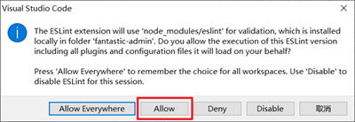

# 代码规范

## IDE 编辑器

:::tip
请确保已阅读[准备工作](start.md#准备工作)，并且按照文档说明安装好相关软件及扩展。
:::

为保证代码风格统一，请使用 [Visual Studio Code](https://code.visualstudio.com/) 做为开发 IDE ，模版源码里已提供相关配置文件，可直接查看效果：在保存代码时，会自动对当前文件进行代码格式化操作。

:::tip
无法实现自动格式化代码的效果，请随便打开一个 `.js` 或 `.vue` 文件，检查编辑器右下角的 ESLint 是否显示为✔️，如果显示为🚫，则需要点击并选择“Allow”。

:::

## Git 钩子

上述操作仅对代码的写法规范进行格式化，例如缩进、空格、结尾的分号等。

而在提交代码时， Git 的钩子会检查代码中是否有错误，这些错误是 IDE 无法自动修复的，例如出现未使用过的变量。如果有错误，则会取消此次提交，直到开发者修复完所有错误后才允许提交成功，确保仓库里的代码绝对正确。

可通过修改 `.eslintignore` 和 `.stylelintignore` 忽略无需做代码规范的文件，例如在项目中引用了一些第三方的插件或组件，我们就可以将其忽略

## 配置代码规范

配置文件主要有 3 处，分别为 IDE 配置（`.editorconfig`）、ESLint 配置（`.eslintrc.js` 和 `.eslintignore`）、StyleLint 配置（`.stylelintrc` 和 `.stylelintignore`）。

## 关闭代码规范

如果不想使用 ESLint 和 stylelint 强制规范代码，可将 `src/` 目录分别加入 `.eslintignore` 和 `.stylelintignore` 进行忽略即可。